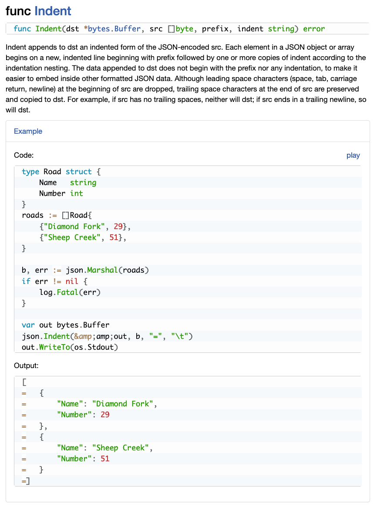

# go-highlight-userscript

Syntax highlights any `<pre>` element on the Go or GoDoc site.

Uses [Prism](http://prismjs.com/) to do the syntax highlighting. Edit the script if you want a different theme (or extra plugins).

This is a fork of the original project using a light visual theme instead of a dark one.

## Screenshot

## License

MIT
